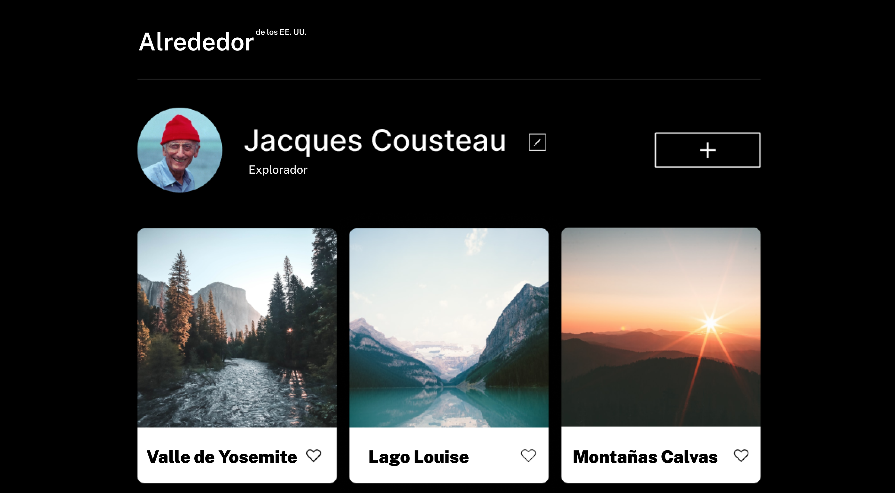
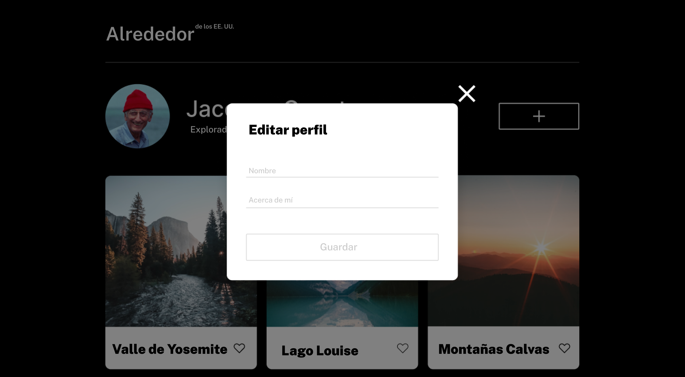

# Tripleten web_project_around

## Refactorización con POO

## 1. Resumen del proyecto

**WEB PROJECT AROUND** es una pagina web interactiva como Instagram, donde el usuario va poder dar like y dislike a una foto, va poder agregar fotos, va poder cambiar el nombre de usuario, su avatar. Se hizo funcional y se valido los formularios de agregar tarjeta y modificar perfil, este proyecto ha sido desarrollado siguiendo las mejores prácticas de Programación Orientada a Objetos (POO), incorporando interactividad avanzada y conectándose con una API para el almacenamiento y gestión de datos en tiempo real. Actualmente, está completado como una aplicación en JavaScript Vanilla, y el siguiente paso es refactorizarlo para React. 💪.

### Prototipos de Alta Fidelidad:

Vista Principal de Alta fidelidad:

Cuadro emergente "Editar perfil":

## 5. Características Principales

- **HTML Semántico:** Utilizado para estructurar y marcar nuestra página web de manera clara y accesible, definiendo la disposición y los elementos visuales de forma adecuada.

- **CSS Responsive:** Utilizado para diseñar y presentar la interfaz de manera que mejora la experiencia del usuario. Se han aplicado estilos, colores y diseños mediante media queries, flexbox y grid para asegurar una visualización óptima en diversos dispositivos y tamaños de pantalla.

-**Programación Orientada a Objetos (POO):** Se implementaron clases para encapsular y organizar funcionalidades específicas.

-**Interactividad Avanzada:** Los usuarios pueden:

- Dar "me gusta" a las tarjetas.

- Eliminar tarjetas existentes (con confirmación previa).

- Crear nuevas tarjetas.

- Ver las imágenes en un popup modal.

-**Validación de Formularios:** Cada campo del formulario es validado, mostrando mensajes de error cuando es necesario, mejorando la experiencia del usuario.

-**Optimización con Webpack:**

- Uso de Webpack para empaquetar archivos.

- Babel para la transpilación de JavaScript moderno.

- Minificación y autoprefixing de CSS.

-**Integración con API:**

- Carga de información del usuario y tarjetas iniciales desde un servidor.

- Gestor de datos de perfil.

- Sincronización de "me gusta" en tiempo real.

### Lenguaje de Programación

- **JavaScript (JS):** Esencial para la interactividad y la funcionalidad dinámica de nuestra pagina web. Empleado para la manipulación del DOM con event listeners, y funciones que permiten acciones y comportamientos en tiempo real.

### Herramientas Adicionales

- **Control de Versiones (Git):** Esencial para el seguimiento eficiente de cambios en el código.
- **Prototipado y Diseño de Interfaz (Figma):** Utilizado para el prototipado y diseño de la interfaz, permitiendo la creación de maquetas visuales y la planificación de la experiencia de usuario. [Prototipo-figma](https://www.figma.com/design/7y3qT82qkZjXO7xvdzJ4pA/Sprint-12-Around-US-ES?node-id=0-1&node-type=canvas&t=CDOIzTkreRq4iYhd-0)
- **Visual Studio Code:** Se ha utilizado Visual Studio Code como entorno de desarrollo para la implementación del diseño y la gestión del código.

## 6. Responsividad

**PROJECT AROUND** es completamente responsiva, adaptándose a diferentes resoluciones y dispositivos. Se han utilizado Media Queries, Flexbox y Grid para optimizar la visualización y la navegación en distintos dispositivos.

## Instrucciones de Uso

1. Clona el repositorio.
2. Abre los archivos `js, html, css` en tu navegador para explorar PROJECT AROUND.
3. Disfruta de la experiencia inmersiva y mira como se desarrollo el proyecto.

### Equipo de Diseño y Desarrollo

Este proyecto fue desarrollado por:

- [Franchesca Fatima Zelaya](https://github.com/FranchescaF)

Como parte de un proyecto práctico como estudiante de desarrollo web de TripleTen. Si tienes preguntas o comentarios, no dudes en ponerte en contacto al correo electrónico: fatimapolgar2001@gmail.com

## Visita la web:

- [Página Web](https://franchescaf.github.io/web_project_around/)
